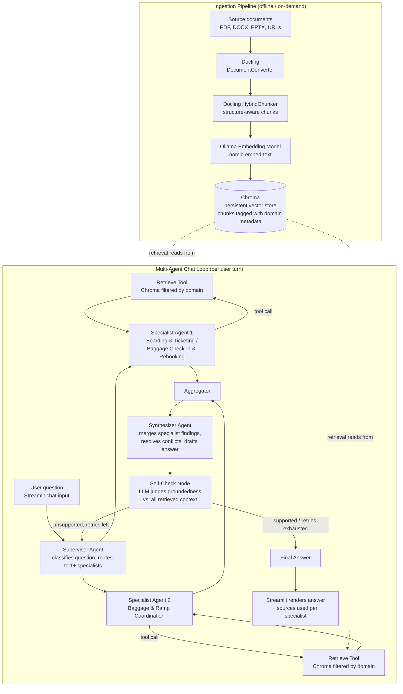

# Virtual Gate Agent — Architecture & Wiring Plan

A fully local, multi-agent RAG chatbot that acts *as* a gate agent — a customer-facing assistant passengers talk to directly, not an internal lookup tool for employees. No cloud dependencies, no API costs.

**Stack:** Docling (ingestion) → Chroma (vector store) → LangGraph multi-agent system on Ollama (supervisor + domain specialists + synthesizer, with self-check) → Streamlit (UI)

---

## 1. High-Level Flow



Both specialists are typically invoked per question given the small set — the supervisor's routing choice matters more once a domain has several specialists competing for a query than it does with just two closely related ones.

---

## 2. Components

### 2.1 Ingestion: Docling

- Converts raw source documents (PDF, DOCX, PPTX, and URLs) into structured data, preserving text, tables, section headers, and formulas rather than flattening everything to plain text.
- `HybridChunker` splits the structured document into chunks that respect document boundaries (won't split a table mid-row) while staying within a token budget suitable for the embedding model.
- Output of this stage: a list of text chunks, each tagged with metadata (source file, chunk index, and optionally section/page).
- Runs offline / on-demand — this is not part of the live chat request path. It's triggered whenever new documents are added or existing ones change.

### 2.2 Storage: Chroma

- Persistent vector store, embedded directly in the Python process — no separate server to run or manage.
- Each chunk is embedded (via an Ollama-hosted embedding model) and stored with its metadata, enabling both semantic similarity search and metadata filtering (e.g., "only search chunks from report_2025.pdf," or — in the multi-agent design — "only search chunks tagged to the Maintenance specialist's domain").
- One shared collection, not one per specialist: each specialist's `retrieve` tool just applies a different metadata filter (e.g., a `domain` or `far_part_group` field) over the same underlying store. Simpler to maintain than separate collections, and still gives each specialist an isolated view of the corpus.
- Chunk IDs are derived deterministically from `source + chunk_index`, so re-ingesting an updated document overwrites the old chunks instead of duplicating them.
- Storage lives on local disk in a persistent directory — no ongoing cost, no external dependency.

### 2.3 Embedding & Chat Models: Ollama

- **Embedding model** (e.g. `nomic-embed-text`): converts chunk text and user queries into vectors for similarity search. Runs locally via Ollama.
- **Chat model** (e.g. `qwen2.5` or `llama3.1`): the reasoning engine for the agent. Needs solid tool-calling support, since the agent's core behavior (deciding when to retrieve) depends on it.
- Both models are pulled once via Ollama and run entirely on local hardware — no per-token API cost.

### 2.4 Orchestration: LangGraph Multi-Agent System

Instead of one agent doing everything, responsibility is split across specialized roles. This is the **supervisor pattern**: one routing agent, several domain specialists, one synthesizer, one quality gate.

| Role | Responsibility |
|---|---|
| **Supervisor agent** | Reads the user's question and decides which specialist(s) are relevant (one, several, or — for narrow-scope questions — just one). Routes the question to those specialists. Also the re-entry point if self-check fails. |
| **Specialist agents** (2–4, domain-scoped) | Each is a small retrieve-capable agent focused on one subject area, with its own system prompt and its own `retrieve` tool pre-scoped to that domain's slice of the corpus (via metadata filtering, not a separate vector store). Each can call `retrieve` more than once to refine its query, same as the single-agent version did. |
| **Aggregator** | Simple merge step — collects each invoked specialist's findings (draft notes + the chunks they retrieved) into one shared state, no LLM call needed. |
| **Synthesizer agent** | Takes the aggregated specialist findings and produces one coherent final answer **in the first-person voice of a gate agent talking to a passenger** — plain language, warm and professional customer-service tone, no internal jargon or raw policy citations dumped on the passenger. Resolves overlaps and consolidates what it can say confidently. |
| **Self-check node** | Judges whether the synthesized answer is actually supported by the retrieved context. If not, and retries remain, routes back to the supervisor with a critique. If retries are exhausted and the answer still isn't well-grounded, the fallback is **not** a best-guess answer — it's a clear "let me get you to a human agent for this" response (see §7 below). |

**Why multi-agent vs. one agent with one tool:**
- **Focused prompts beat one generalist prompt.** A specialist scoped to "maintenance guidance" can have a system prompt and retrieval scope tuned to that vocabulary, instead of one prompt trying to cover every domain adequately.
- **Parallelizable.** When a question spans domains (e.g., "what maintenance signoffs affect part 91 operating limits"), specialists can run concurrently instead of one agent serially reasoning through both areas.
- **Cleaner scaling.** Adding a new domain (e.g., airport/Part 150 guidance) means adding one new specialist node, not re-tuning one large prompt that's already covering several domains.
- **Trade-off to know going in:** more LLM calls per turn than the single-agent version (supervisor routing + N specialists + synthesis + self-check), so latency and local-compute load go up. Worth it once domain scope is broad enough that one generalist agent starts giving inconsistent answers across topics — not necessary for a narrow corpus.

### 2.5 Interface: Streamlit

- Standard chat UI: message history, chat input box, streaming/spinner while the agent runs.
- Displays the final answer in gate-agent voice. Whether the underlying "sources used" are shown to the passenger is a real design choice, not a default: for a passenger-facing bot, raw source citations (document names, policy numbers) probably don't belong in the main chat bubble — they read as internal jargon. Worth keeping them available in a collapsed/debug view (useful during development and for auditing what the bot grounded its answer in) without surfacing them in the passenger-facing conversation by default.
- Sidebar for setup checklist and a "clear conversation" control to reset session state.
- Runs as a single local web app — no external hosting required.

---

## 3. Wiring Plan (data & control flow)

**Ingestion path (run when documents are added/updated):**

```
Source files/URLs
   → Docling DocumentConverter
   → Docling HybridChunker
   → Ollama embedding model
   → Chroma (persistent collection)
```

**Query path (run per user message):**

```
Streamlit chat input
   → LangGraph graph invoked with full message history
   → Supervisor agent classifies the question → routes to relevant specialist(s)
   → Each routed specialist (runs independently, in parallel where the graph allows):
        ├── decides to call `retrieve` (domain-filtered) → results appended to its own working notes → may re-query
        └── produces a domain-scoped draft finding + list of chunks it used
   → Aggregator merges all invoked specialists' findings + retrieved chunks into shared state
   → Synthesizer agent combines aggregated findings into one final draft answer
   → Self-check node (Ollama chat model judges groundedness against the full aggregated context)
        ├── UNSUPPORTED + retries remaining → critique appended → back to Supervisor (may re-route or ask a specialist to re-retrieve)
        └── SUPPORTED or retries exhausted → finalize
   → Streamlit renders final answer + source list grouped by specialist
```

**State carried across the loop:**
- Full message history — passed to the graph each turn so context persists across the conversation.
- Per-specialist working state (which specialists were invoked, what each retrieved, each one's draft finding) — collected by the aggregator, consumed by the synthesizer.
- Retry counter — reset each new user turn, incremented only by the self-check node.

---

## 4. Key Configuration Points

| Setting | Where it lives | Notes |
|---|---|---|
| Chat model name | Agent config | Must support tool calling reliably; test a couple of models if retrieval seems inconsistent |
| Embedding model name | Ingestion + agent config (must match) | Same model must be used for both ingesting and querying, or similarity search breaks |
| Chunk size / overlap | Ingestion config | Tune based on document density; denser technical docs may want smaller chunks |
| Top-K retrieved chunks | Retrieve tool config | Controls how much context feeds each answer — tradeoff between completeness and noise |
| Max self-check retries | Agent config | Caps latency/cost of the self-check loop; 1–2 is usually enough |
| Chroma persistence directory | Storage config | Where the vector collection lives on disk |
| Specialist domain definitions | Supervisor + specialist config | Which domains exist, their metadata filter values, and each specialist's system prompt |
| Routing strategy | Supervisor config | Whether the supervisor can route to multiple specialists per question (parallel) or only one (simpler, less coverage for cross-domain questions) |

---

## 5. Setup Sequence (no code, just order of operations)

1. Install Ollama and pull the chat model and embedding model.
2. Point the ingestion process at a folder of source documents (or individual URLs).
3. Run ingestion — produces a populated, persistent Chroma collection.
4. Launch the Streamlit app — it builds the LangGraph agent on startup and connects to the existing Chroma collection.
5. Chat. Re-run ingestion any time new or updated documents need to be added; existing chunks for a changed file are overwritten rather than duplicated.

---

## 6. Use Case: Virtual Gate Agent (Passenger-Facing)

**Data source:** Internal gate agent training manuals and materials (boarding procedures, customer service SOPs, irregular operations handling, special assistance policies, etc.) — typically **proprietary/internal airline or airport-operator documents**.

**Who's actually talking to this system matters here.** Earlier drafts of this plan assumed a gate agent employee querying the system to look something up. This version *is* the gate agent from the passenger's point of view — it answers passengers directly, in a customer-service voice, rather than surfacing raw policy text for an employee to interpret. That shifts several things:

- **Tone**: warm, plain-language, first-person ("I can help you with that" / "Let me check on your bag"), not "per AC 91-79A" style citation-dropping. The Synthesizer agent (§2.4) owns this voice.
- **Confidence bar is higher**: an employee reading a slightly-off policy excerpt can sanity-check it against experience; a passenger getting a slightly-off answer directly may act on it (miss a rebooking window, board with the wrong document). This is exactly why the self-check node's fallback is "hand off to a human" rather than a best-effort guess (§7).
- **Confidentiality**: source documents likely shouldn't be treated as freely shareable, even though the bot's *answers* are meant for public/passenger consumption. Worth tagging metadata with an internal confidentiality/sensitivity level, and keeping the underlying manuals themselves access-controlled even though the chat interface is passenger-facing.
- **Supplementary public regulation**: some of what a gate agent needs traces back to public federal rules that can be ingested alongside the internal manuals for grounding, e.g. [14 CFR Part 250](https://www.ecfr.gov/current/title-14/chapter-II/subchapter-D/part-250) (oversales/denied boarding), [14 CFR Part 382](https://www.ecfr.gov/current/title-14/chapter-II/subchapter-D/part-382) (nondiscrimination on the basis of disability — wheelchair service, service animals), and TSA screening/security procedures relevant to gate operations. Keeping these separate from internal SOPs in metadata (`source_type: internal` vs `source_type: public_regulation`) matters, since internal policy sometimes goes beyond the regulatory floor and the agent shouldn't blur the two when citing.
- **Document lifecycle**: training manuals get revised (new procedures, updated seasonal policies like holiday travel rules); an `effective_date` / `version` field matters here just as much as it did for AC revisions.

### Specialist mapping for this domain

| Specialist | Covers | Example question it'd handle |
|---|---|---|
| **Boarding & Ticketing and Baggage Check-in & Rebooking** | Boarding procedures, ID/ticket/document verification, oversold flights & denied boarding (14 CFR Part 250), baggage check-in process, rebooking due to delays/cancellations/misconnections | "What's the process when a flight is oversold at check-in?" / "How do I rebook a passenger who missed a connection?" |
| **Baggage & Ramp Coordination** | Checked-bag handling on the ramp side, gate-checking carry-ons, communicating with ramp/baggage crews, baggage irregularities (damaged/delayed/lost) | "When does a carry-on get gate-checked instead of boarded?" / "What's the process for reporting a damaged checked bag to the ramp crew?" |

Two specialists total — one covers the passenger-facing front-of-house flow (ticketing, boarding, check-in, rebooking), the other covers the operational back-of-house flow (physical baggage handling and ramp coordination). This keeps the split simple: front-of-house vs. back-of-house, rather than splitting by finer procedure type.

### Additional metadata fields for this use case

| Field | Why it matters |
|---|---|
| `source_type` (`internal` / `public_regulation`) | Keeps proprietary SOPs distinct from cited public rules in answers |
| `confidentiality` (e.g. `internal_use_only`) | Signals sensitivity; supports access-control decisions outside the RAG system itself |
| `procedure_category` | Maps to the 2-specialist split above (front-of-house vs. back-of-house) for retrieval filtering |
| `effective_date` / `version` | Surfaces which revision of a procedure is current, same role AC revision dates played before |
| `station` / `airline` (if materials cover more than one) | Relevant if training content varies by airport station or carrier |

### A note on scope

FAA and DOT public regulations (14 CFR Part 250, Part 382, TSA requirements) set a floor, but internal training manuals often add airline- or station-specific procedure on top of that floor. As a passenger-facing bot, this system should stick to what the manuals actually say and hand off anything it can't ground confidently — see §7 below for exactly where that line should sit.

---

## 7. Boundaries & Escalation

Because this bot speaks *as* the gate agent rather than *to* one, it needs explicit limits on what it's allowed to answer on its own versus when it hands off to a human. Worth deciding these deliberately rather than letting them fall out of default LLM behavior:

| Situation | Behavior |
|---|---|
| Question is answered clearly and confidently by retrieved policy | Answer directly, in gate-agent voice |
| Self-check flags the answer as unsupported, retries exhausted | Hand off: "Let me get a team member to help you with that" — never a best-guess answer on a passenger-facing policy question |
| Question requires **real-time data this system doesn't have** (actual flight status, actual seat/gate assignment, actual booking record) | Explicitly out of scope for a RAG-over-manuals system — it only knows *policy and procedure*, not live operational data. Needs a clear "I don't have access to your specific booking" response rather than guessing, and a path to a human or the airline's live systems. |
| Question implies an **action** (rebook me, refund me, issue a voucher) | RAG alone can explain the policy but can't execute a transaction — that requires integration with real booking/ops systems, which is a separate build from this architecture. Worth deciding early whether this system stays informational-only or grows into a tool-calling agent connected to real backend systems later. |
| Passenger is upset, escalated, or the situation is sensitive (disability accommodation dispute, denied boarding compensation dispute, etc.) | Route to a human quickly rather than letting the bot attempt de-escalation — customer-service judgment in a charged situation is a different skill than policy lookup. |
| Passenger shares personal/sensitive information (medical details, PII) | Bot shouldn't retain or repeat this beyond what's needed to answer the immediate question; this system as designed has no durable per-passenger memory, which is the safer default here. |

This table is the honest boundary of what a local RAG system (even a multi-agent one) is good for: **explaining policy accurately**, not **executing transactions** or **replacing human judgment in charged moments**. Keeping that boundary explicit in the system prompts (not just hoped for) is worth treating as a first-class design requirement, not an afterthought.

---

## 8. Things to Revisit as This Grows

- **Model choice**: if the chat model under- or over-triggers retrieval, that's the first thing to swap/tune.
- **Scale**: Chroma is well-suited to personal/small-team knowledge bases (up to roughly a few million vectors); a migration path to something like Qdrant or pgvector is worth planning for if the corpus grows well beyond that.
- **Self-check cost**: each self-check adds one extra LLM call per turn — worth an on/off toggle if latency becomes more important than answer verification.
- **Multi-user / production concerns** (auth, concurrent access, backups) are out of scope for this personal-use architecture and would need to be layered in separately if requirements change.
- **Specialist count**: currently 2 (front-of-house vs. back-of-house). Each additional specialist adds routing complexity and per-turn LLM calls — only split further (e.g., pulling rebooking/IROPS out on its own) once real usage shows one of these two is straining to cover too much ground.
- **Routing accuracy**: the supervisor's classification is itself a place errors can creep in (e.g., misrouting a rebooking question to the Baggage & Ramp specialist instead of Boarding & Ticketing). Worth spot-checking routing decisions early, since a wrong route means the right specialist never even ran.
- **Voice consistency**: with the persona shift to passenger-facing, it's worth periodically checking that the Synthesizer is actually staying in gate-agent voice and not leaking internal document language (policy numbers, internal-only terminology) into passenger-facing answers.
