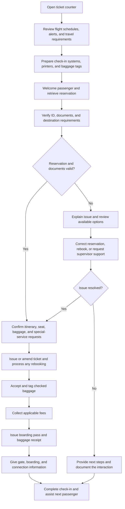

# Gate Agent Routine at the Ticket Counter

## Key Responsibilities

- Welcome passengers, retrieve reservations, and apply the airline's ticketing and baggage rules.
- Verify identification, required travel documents, and destination-specific entry requirements before check-in.
- Issue or amend tickets, assign seats, check flight loads, identify codeshare itineraries, and rebook passengers when needed.
- Accept, tag, and receipt checked baggage; collect applicable fees; and provide boarding, gate, and connection information.
- Use the airline's departure-control and reservation systems accurately, including the command sequences needed for check-in, ticketing, flight loads, and rebooking.
- At smaller or outstation airports, cross-trained agents may alternate between the ticket counter and gate duties during the same shift.

