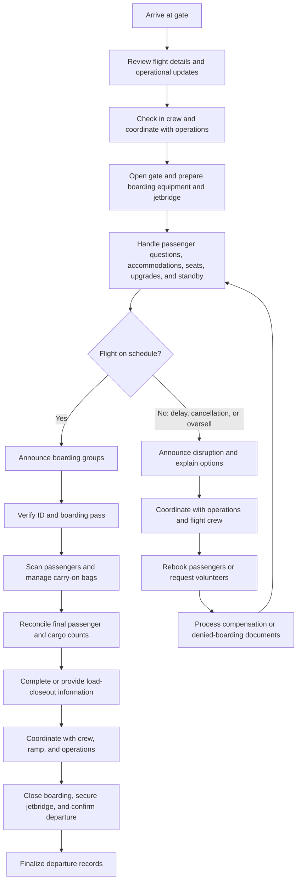

# Gate Agent Routine at the Gate

## Key Responsibilities

- Review flight details, operational updates, boarding rules, and passenger-service requirements before opening the gate.
- Check in the operating crew and coordinate with the flight crew, ramp team, and operations control throughout the turnaround.
- Manage seats, upgrades, standby travelers, carry-on restrictions, and passenger accommodations.
- Operate the jetbridge in accordance with airline procedures and confirm that it is positioned safely for boarding and departure.
- During disruptions or oversales, communicate updates, seek volunteers when applicable, rebook passengers, and complete required denied-boarding documentation.
- Complete or provide the information needed for the flight load closeout, including final passenger and cargo counts. The flight crew uses this information for weight-and-balance and performance calculations; the exact workflow and ownership vary by airline and ground handler.

